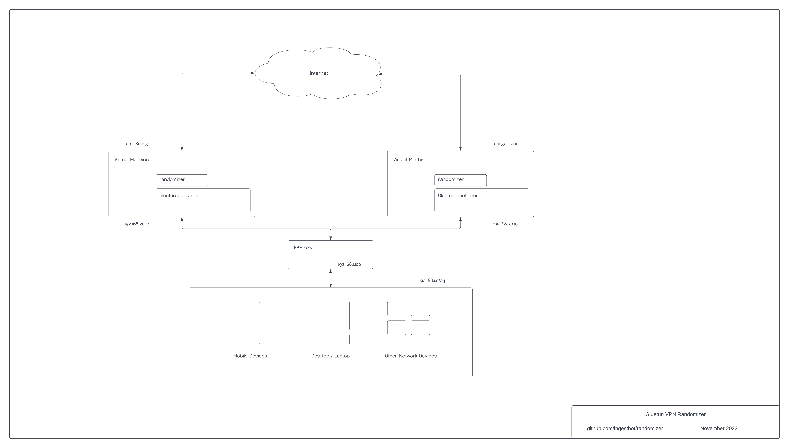

# mything (dumper230)

This is my thing.

---
Here's the same image but in my repo

[gluetun_vpn_randomizer.png](images/gluetun_vpn_randomizer.png)

---

### Example Architecture

This is one of many examples of using multiple VPN instances in a given environment.

- LAN: 192.168.1.0/24 
    - Consists of a mix of mobile devices, desktops/laptops, and virtual machines
    - All devices in this network use an HTTP/HTTPS proxy of the assigned fronted in HAProxy (eg, 192.168.1.100:8118)
- HAProxy: 192.168.1.100
    - Acts as load balancer and distribution to multiple Gluetun VPN instances
    - In this example port 8118 is the listening HTTP/HTTPS proxy
    - See the configuration example [haproxy.cfg](haproxy/haproxy.cfg)
- Virtual Machines: 192.168.20.10, 192.168.30.10
    - Separate subnets of 192.168.20/24 and 192.168.30/24 are optional
    - Each virtual machine contains a running randomizer and Docker container(s)
    - Outbound IP addresses 23.11.82.103, 201.32.11.201 are randomly assigned based on VPN provider(s) configured in gluetun and frequency of rotation

